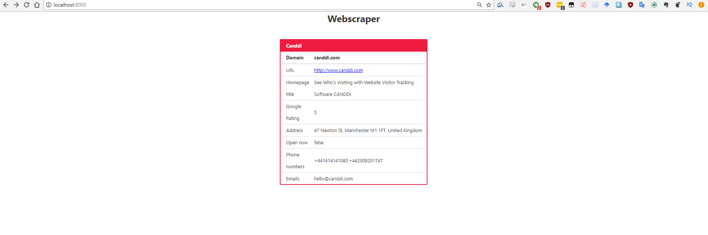
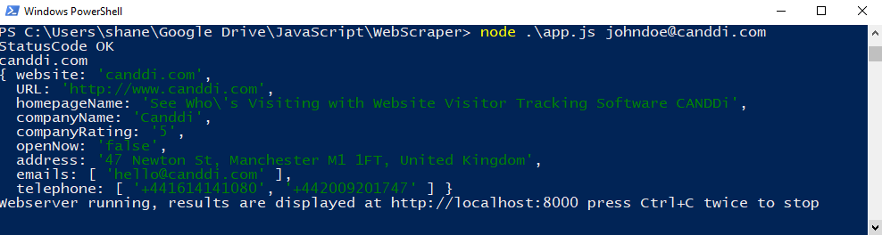

# Dynamic Web Scraper
> Scrapes a Website that is taken from an inputted emails domain.

This project uses ECMAScript 6(2015)

## Screenshots
### Webapp view


### CLI view


## Installation

Windows & OS X & Linux:

```sh
git pull https://github.com/Crithane/dynamicWebScraper.git
npm install
```

## Usage example

```sh
node app.js johndoe@example.com
```

## Features
* **Dynamically scrapes any domain's website from an inputted email address
* **Grabs all phone numbers from website
* **Grabs all email addresses from website
* **Utilizes GMaps API to grab companies address
* **Utilizes GMaps API to grab companies name
* **Utilizes GMaps API to grab companies rating
* **Utilizes GMaps API to see if company is open at the time of the request
* **Saves all scraped data to /domain/domain.json
* **Displays data in a table on a webapp hosted on localhost:8000

## Dependencies
* **NodeJS - https://nodejs.org/en/
* **npm - https://github.com/npm/npm
* **express - https://github.com/expressjs/express
* **express-handlebars - https://github.com/ericf/express-handlebars
* **cheerio - https://github.com/cheeriojs/cheerio
* **knwl - https://github.com/loadfive/Knwl.js/
* **google-maps-services-js - https://github.com/googlemaps/google-maps-services-js

## Authors

* **Shane Critchley-Kenyon**


<!-- Markdown link & img dfn's -->
[npm-image]: https://img.shields.io/npm/v/datadog-metrics.svg?style=flat-square
[npm-url]: https://npmjs.org/package/datadog-metrics
[npm-downloads]: https://img.shields.io/npm/dm/datadog-metrics.svg?style=flat-square
[travis-image]: https://img.shields.io/travis/dbader/node-datadog-metrics/master.svg?style=flat-square
[travis-url]: https://travis-ci.org/dbader/node-datadog-metrics
[wiki]: https://github.com/yourname/yourproject/wiki
